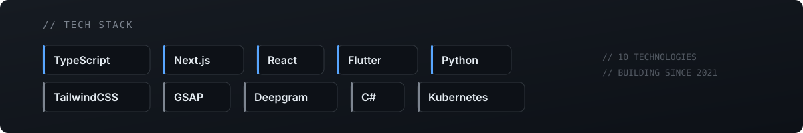
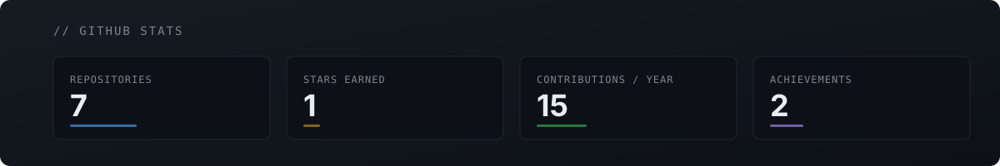
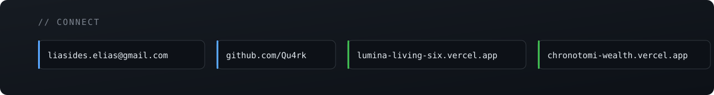

  

---

I'm **Qu4rk** — a full-stack developer and AI engineer based in Limassol, Cyprus. I build production applications spanning real-time speech recognition, luxury web experiences, mobile apps, and wealth management platforms.

My focus is on **AI-powered products**: ambient classroom intelligence with Deepgram STT, AI-driven PC build planners in Flutter, and cinematic web design with GSAP. Currently exploring Kubernetes and advanced React patterns. Open to collaborating on websites, open-weight models, and fullstack projects.

---

  

---

  

---

  

---

  

