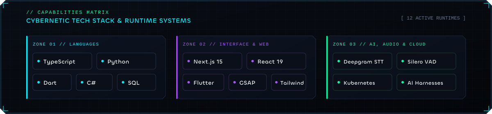
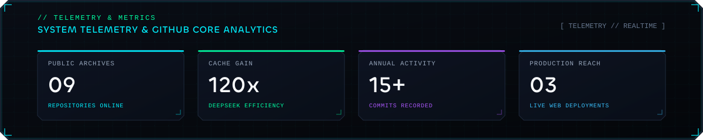
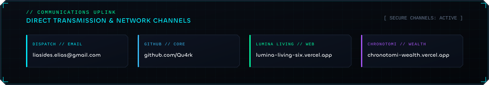

  

  <a href="#-active-systems--production-architecture"><b>Systems &amp; Architecture</b></a> •
  <a href="#-capabilities--runtime-matrix"><b>Capabilities Matrix</b></a> •
  <a href="#-telemetry--metrics"><b>Telemetry</b></a> •
  <a href="#-communications-uplink"><b>Uplink</b></a>

---

### `//` TRANSMISSION OVERVIEW

I'm **Qu4rk** (Elias Liasides) — a full-stack developer and AI systems engineer based in **Limassol, Cyprus** `[34.7071° N, 33.0226° E]`. I design and build production software spanning real-time speech intelligence, high-performance LLM cache optimization, luxury cinematic web experiences, and cross-platform mobile architecture.

#### Key Engineering Focus
- ⚡ **Ambient Speech & Real-Time Intelligence**: Production classroom STT with Deepgram, streaming Silero VAD, and sub-second latency audio processing in Next.js 14.
- 🎯 **LLM Cost & Prefix Optimization**: Engineered [CacheSnipe](https://github.com/Qu4rk/CacheSnipe), an OpenCode plugin locking prompt prefixes to unlock 50x–120x cheaper cache-read pricing on DeepSeek models.
- 💎 **Luxury Cinematic Web Architecture**: High-fidelity interactive digital experiences choreographed with GSAP motion engines and micro-interactions.
- 📱 **Mobile & Systems Development**: Architecture-driven Flutter applications with local SQLite offline storage, clean layered patterns, and Kubernetes deployment workflows.

---

### `//` CAPABILITIES & RUNTIME MATRIX

  

| Discipline | Core Technologies | Focus &amp; Implementations |
| :--- | :--- | :--- |
| **Languages &amp; Runtimes** | `TypeScript`, `Python`, `Dart`, `C#`, `SQL`, `JavaScript` | Strict typing, async concurrency, stream processing |
| **Frontend &amp; Motion** | `Next.js 15`, `React 19`, `GSAP`, `TailwindCSS` | Cinematic animations, SSR/Edge streaming, performance optimization |
| **Mobile Engineering** | `Flutter`, `Dart`, `SQLite`, `Provider/Riverpod` | Offline-first storage, hardware optimization, responsive layouts |
| **AI, Audio &amp; Infra** | `Deepgram STT`, `Silero VAD`, `Kubernetes`, `Docker`, `OpenCode` | Ambient voice capture, prompt prefix caching, container orchestration |

---

### `//` ACTIVE SYSTEMS &amp; PRODUCTION ARCHITECTURE

  

#### [01 // Talli](https://github.com/Qu4rk/Talli) `[ LIVE // PRIMARY EDUCATION ]`
- **Architecture**: Real-time Greek ambient speech recognition & AI point tracking engine designed for Cyprus Primary Education (Δημοτικό Α'-ΣΤ').
- **Stack**: `Next.js 14` • `Deepgram STT` • `Silero VAD` • `TypeScript` • `Neobrutalism UI`
- **Repository**: [github.com/Qu4rk/Talli](https://github.com/Qu4rk/Talli)

#### [02 // CacheSnipe](https://github.com/Qu4rk/CacheSnipe) `[ NEW // OPEN-SOURCE TOOL ]`
- **Architecture**: OpenCode plugin that locks the DeepSeek prompt prefix to guarantee constant cache hits, delivering **50x–120x cheaper** cache-read pricing.
- **Stack**: `TypeScript` • `DeepSeek API` • `Prompt Cache Locking` • `OpenCode Tooling`
- **Repository**: [github.com/Qu4rk/CacheSnipe](https://github.com/Qu4rk/CacheSnipe)

#### [03 // LuminaLiving](https://lumina-living-six.vercel.app) `[ LIVE // LUXURY WEB ]`
- **Architecture**: Exclusive coastal residence showcase featuring multi-stage GSAP scroll-driven animations, parallax viewports, and bespoke architectural galleries.
- **Stack**: `Next.js` • `React` • `GSAP Motion` • `TypeScript` • `TailwindCSS`
- **Deployment**: [lumina-living-six.vercel.app](https://lumina-living-six.vercel.app)

#### [04 // chronotomi-wealth](https://chronotomi-wealth.vercel.app) `[ LIVE // WEALTH PLATFORM ]`
- **Architecture**: Private wealth management platform featuring high-value timepiece inventory trackers, investment advisory modules, and secured logistics workflows.
- **Stack**: `HTML5` • `Modern JavaScript` • `Vercel Edge Platform`
- **Deployment**: [chronotomi-wealth.vercel.app](https://chronotomi-wealth.vercel.app)

#### [05 // build_effortless](https://github.com/Qu4rk/build_effortless) `[ REPO // FLUTTER APP ★ 1 ]`
- **Architecture**: AI-driven mobile application engineered for planning, comparing, and benchmarking custom PC component builds with offline SQLite storage.
- **Stack**: `Flutter` • `Dart` • `SQLite` • `AI Optimization Engine`
- **Repository**: [github.com/Qu4rk/build_effortless](https://github.com/Qu4rk/build_effortless)

---

### `//` TELEMETRY &amp; METRICS

  

---

### `//` COMMUNICATIONS UPLINK

  

  <a href="mailto:liasides.elias@gmail.com"><b>Direct Dispatch: liasides.elias@gmail.com</b></a> •
  <a href="https://github.com/Qu4rk"><b>GitHub: @Qu4rk</b></a> •
  <a href="https://lumina-living-six.vercel.app"><b>Lumina Living</b></a> •
  <a href="https://chronotomi-wealth.vercel.app"><b>Chronotomi Wealth</b></a>

