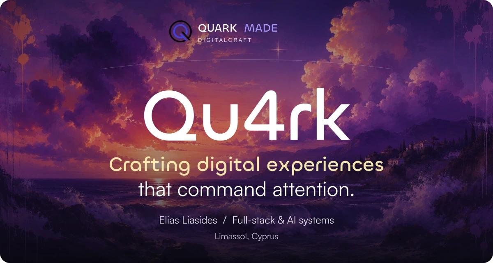
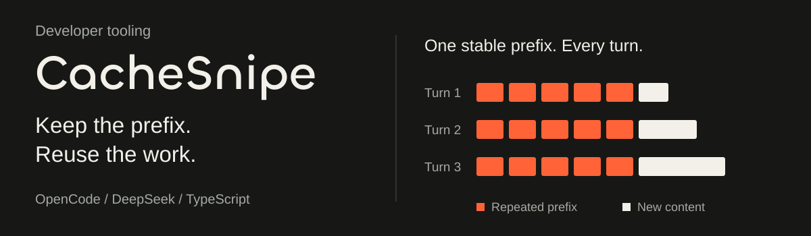
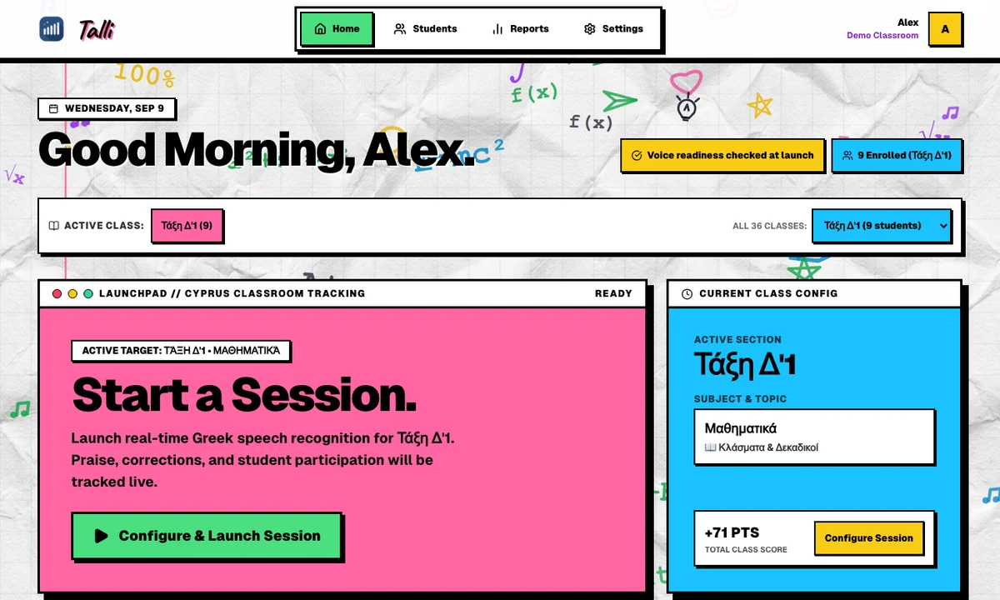
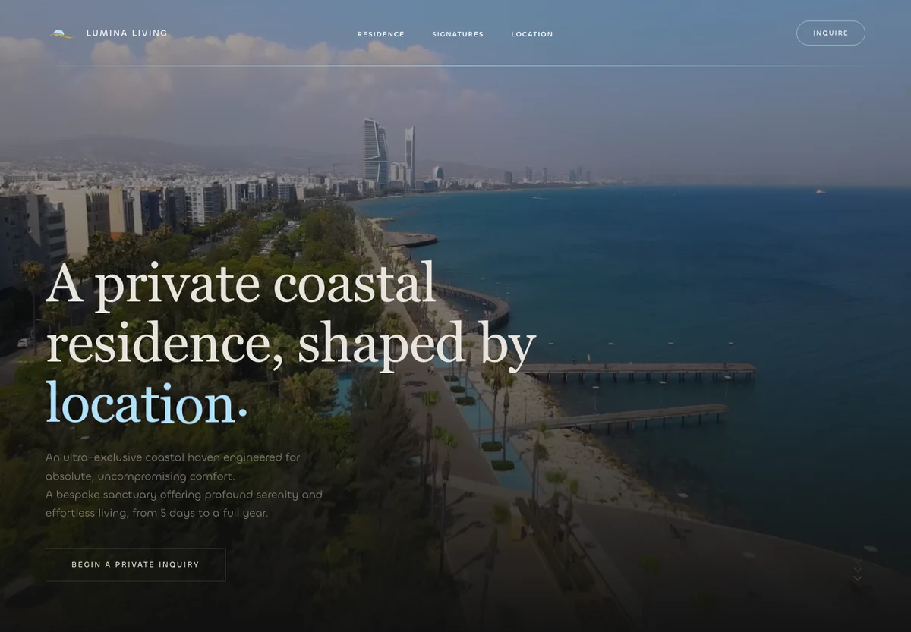
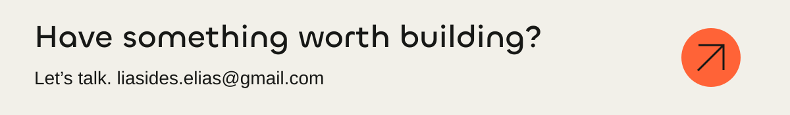

  

  <a href="https://qu4rk.github.io/QuarkMade/">QuarkMade</a> &nbsp; / &nbsp;
  <a href="#selected-work">Selected work</a> &nbsp; / &nbsp;
  <a href="#the-toolkit">The toolkit</a> &nbsp; / &nbsp;
  <a href="mailto:liasides.elias@gmail.com">Get in touch</a>

I'm **Elias**, the developer behind **[QuarkMade](https://qu4rk.github.io/QuarkMade/)**. I work across full-stack software and AI systems from **Limassol, Cyprus**. I build tools that make AI more useful, voice-driven products for real classrooms, and web experiences with a sense of place.

I like working on both sides of a product: how it behaves underneath, and how it feels in someone's hands.

## Selected work

**[CacheSnipe](https://github.com/Qu4rk/CacheSnipe) · Making repeated context count.** An OpenCode plugin that stabilizes DeepSeek prompt prefixes and tracks cache hits, prefix breaks, and token costs. Built for understanding what gets reused and why a cache breaks.

`TypeScript` `OpenCode` `DeepSeek`

### Talli

**Classroom points, in the words you already say.** A voice-powered classroom copilot for primary school teachers in Cyprus. It turns spoken Greek praise and corrections into student points, with uncertain cues sent for review.

Actual application screenshot, cropped to the session dashboard. Fictional demo names and scores.

`Next.js` `TypeScript` `Deepgram` `Silero VAD` &nbsp; **[Explore Talli](https://github.com/Qu4rk/Talli)**

### Lumina Living

**A digital home for a Mediterranean residence.** A coastal property experience built around cinematic typography, scroll choreography, and the character of Cyprus.

`Next.js` `React` `GSAP` &nbsp; **[Visit the experience](https://www.lumina-living.net/)** · [Source](https://github.com/Qu4rk/LuminaLiving)

### Also on my workbench

- **[BuildEffortless](https://github.com/Qu4rk/build_effortless)** — A Flutter app for planning PC builds, comparing components, and saving configurations locally. `Flutter` `Dart` `SQLite`
- **[Chronotomi Wealth](https://github.com/Qu4rk/chronotomi-wealth)** — A luxury timepiece and private advisory web project. [Live site](https://www.chronotomi.com/). `JavaScript` `HTML` `CSS`

## The toolkit

| Area | Tools I work with |
| :--- | :--- |
| Interfaces & motion | TypeScript, React, Next.js, GSAP, Tailwind CSS |
| AI & voice | Python, DeepSeek, Deepgram, Silero VAD |
| Mobile & data | Flutter, Dart, SQLite, SQL |
| Systems | C#, Docker, Kubernetes |

 

  <a href="mailto:liasides.elias@gmail.com">liasides.elias@gmail.com</a> &nbsp; / &nbsp;
  <a href="https://qu4rk.github.io/QuarkMade/">Explore QuarkMade</a> &nbsp; / &nbsp;
  <a href="https://github.com/Qu4rk?tab=repositories">Repositories</a>

